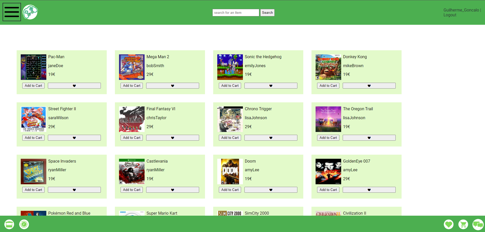
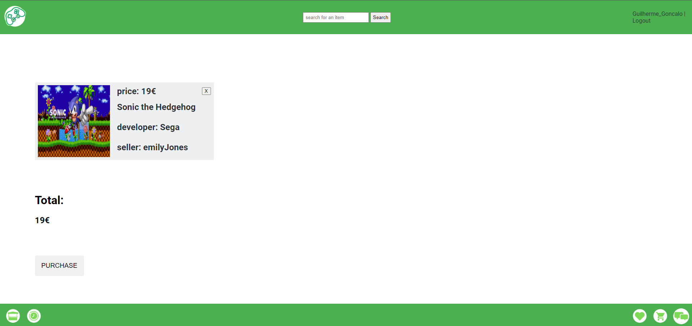
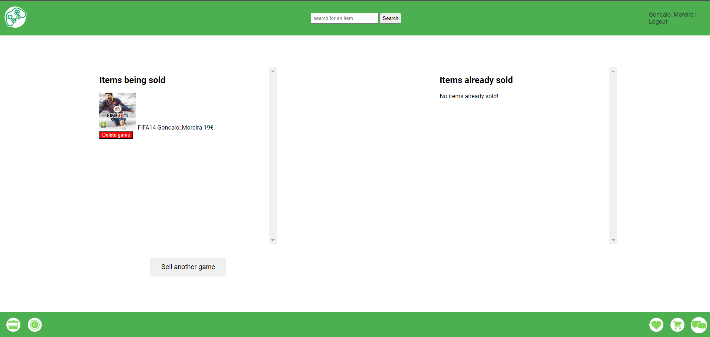

# GEX - Game Exchange

## Group ltw11g01

- Gonçalo Moreira (up202205521) 33%
- Micaela Albino (up202205527) 33%
- Xavier Guimarães (up202206062) 33%

## Install Instructions

    sudo apt-get install php-gd
    git clone git@github.com:FEUP-LTW-2024/ltw-project-2024-ltw11g01.git
    cd ltw-project-2024-ltw11g01
    git checkout final-delivery-v1
    php -S localhost:9000

## Screenshots

## Implemented Features

**General**:

- [ ] Register a new account.
- [ ] Log in and out.
- [ ] Edit their profile, including their name, username and email.

**Sellers**  are able to:

- [ ] List new items, providing details such as genres, developer, device and description, along with an image.
- [ ] Track and manage their listed items.

**Buyers**  are able to:

- [ ] Browse items using filters like genre, price and device.
- [ ] Add items to a wishlist or shopping cart.
- [ ] Proceed to checkout with their shopping cart (simulate payment process).

**Admins**  are able to:

- [ ] Elevate a user to admin status.
- [ ] Introduce new item genres and devices.
- [ ] If needed, block or remove an account from a user.

**Security**:
We have been careful with the following security aspects:

- [ ] **SQL injection**
- [ ] **Cross-Site Scripting (XSS)**

**Password Storage Mechanism**: hash_password&verify_password

**Aditional Requirements**:

We also implemented the following additional requirements:

- [ ] **User Preferences**
- [ ] **Messaging System**
